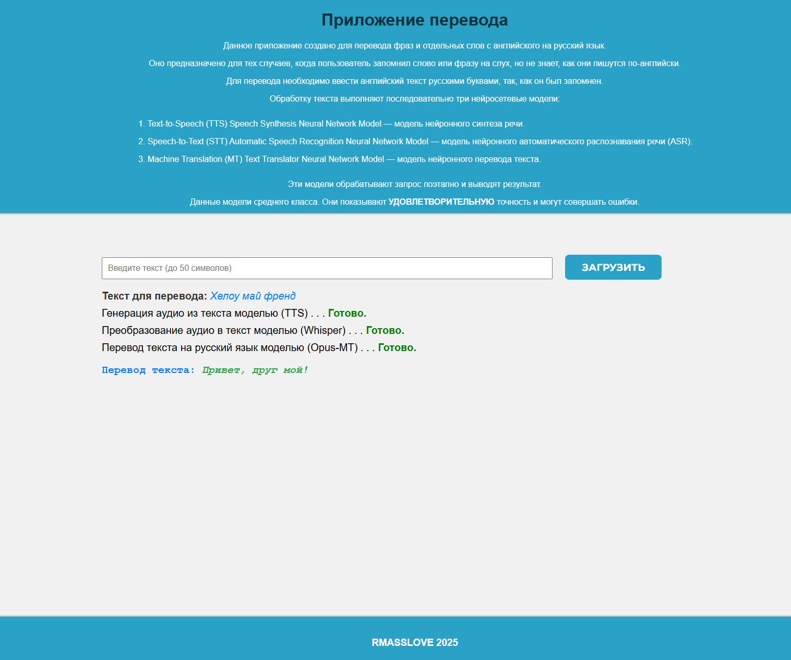

# Описание проекта

"Приложение перевода / Аудио транскрипционный переводчик"

Данное приложение предназначено для перевода фраз и отдельных слов с английского на русский язык. Оно полезно в тех случаях, когда пользователь запомнил слово или фразу на слух, но не знает, как они пишутся по-английски.

## Функциональность

Для перевода пользователю необходимо ввести английский текст русскими буквами так, как он был запомнен. Приложение обрабатывает запрос с помощью нейросетевых моделей, работающих последовательно:

1. **Text-to-Speech (TTS) Speech Synthesis Neural Network Model**  
   Модель нейронного синтеза речи, преобразующая текст в аудио.

2. **Speech-to-Text (STT) Automatic Speech Recognition Neural Network Model**  
   Модель нейронного автоматического распознавания речи (ASR), преобразующая аудио в текст.

3. **Machine Translation (MT) Text Translator Neural Network Model**  
   Модель нейронного перевода текста, переводящая текст с английского на русский язык.

Эти модели работают совместно, обрабатывая запрос поэтапно и выводя конечный результат.

## Особенности

- Данное приложение использует модели среднего класса. 
- Они демонстрируют **удовлетворительную точность**, но могут совершать ошибки. 

Команда для сборки Docker-образа: <docker build -t  mfti_fp_w_docker .>

Ссылка на docker репозиторий: <docker pull rmasslove/mfti_fp_w_docker:v1.0>

